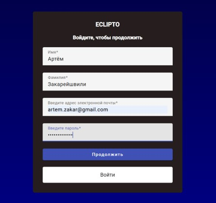
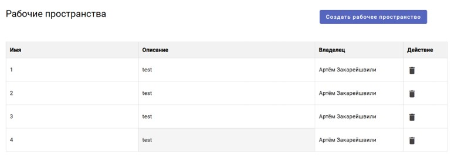
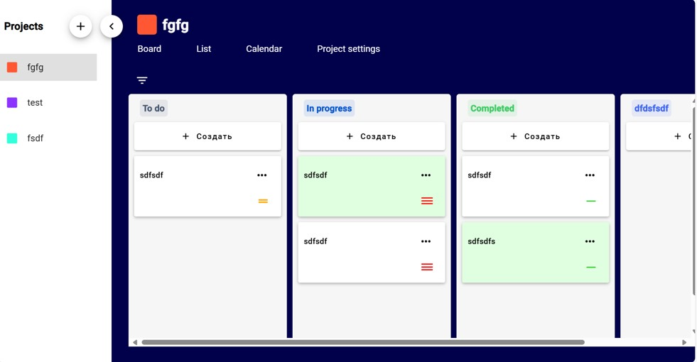
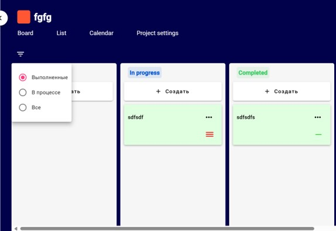
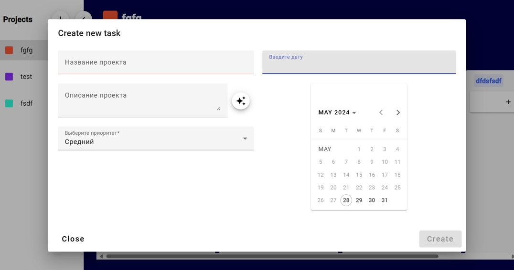

**eclipto-frontend** 🚀

**Описание проекта**

`eclipto-frontend` — сложное одностраничное приложение (SPA) на базе Angular для управления задачами и рабочими пространствами. Проект обеспечивает интуитивный, гибкий интерфейс с реактивным управлением состоянием через NgRx и адаптивным дизайном для любых устройств.

---

## 🎯 Цели и задачи

**Цель:** Построить масштабируемый и расширяемый UI, обеспечивающий плавный и отзывчивый пользовательский опыт при работе с задачами.

**Основные задачи:**

* Разработка SPA с динамической навигацией без перезагрузки страниц
* Реактивное управление состоянием (NgRx Store, Effects, Entity)
* Интеграция с `eclipto-backend` через REST API
* Адаптивный дизайн для desktop, tablet и mobile
* Предоставление готовых макетов страниц и компонентов для быстрой кастомизации

---

## 🚀 Ключевой функционал

1. **Аутентификация и рабочие пространства**

   * Вход пользователя по JWT
   * Список доступных рабочих пространств и переключение между ними

2. **Главная страница**

   * Обзор активных задач и статистики
   * Быстрый доступ к фильтрам по статусу, приоритету и дате

3. **Дополнительные возможности**

   * Канбан‑доска с drag-and-drop на основе Angular CDK
   * Реализация real-time обновлений через WebSocket или polling

4. **Создание и редактирование задач**

   * Форма создания новой задачи с выбором даты через календарь
   * Просмотр календарного представления задач

---

## 📸 Демонстрация интерфейса

1. **Страница входа и рабочие пространства**

   
   

3. **Главная страница приложения**

   

4. **Канбан‑доска и доп. функции**

   
   

5. **Интерфейс создания новой задачи (+ календарь)**

   

---

## ⚙️ Технологический стек

* **Языки:** HTML, CSS, TypeScript
* **Фреймворк:** Angular
* **Управление состоянием:** NgRx (Store, Effects, Entity)
* **UI-библиотеки:** Angular Material, Angular CDK
* **Сборка и запуск:** Angular CLI, Webpack

---

## 📥 Установка и запуск

> **Требования:** Node.js 16+, npm или Yarn

1. Клонируйте репозиторий:

   ```bash
   git clone https://github.com/solurion-team/eclipto-frontend.git
   cd eclipto-frontend
   ```

2. Установите зависимости:

   ```bash
   npm install
   # или
   yarn install
   ```

3. Запустите дев-сервер:

   ```bash
   npm start
   # или
   yarn start
   ```

   Приложение будет доступно по адресу `http://localhost:4200/`.

4. Соберите production-версию:

   ```bash
   npm run build
   # или
   yarn build
   ```

---

## 🛠️ Angular CLI и разработка

Этот проект был сгенерирован с помощью **Angular CLI версии 17.3.2**.

* **Dev-сервер:**

  ```bash
  ng serve
  ```

  Переходите в браузере по адресу `http://localhost:4200/`. Приложение автоматически перезагрузится при изменении исходных файлов.

* **Генерация кода:**

  ```bash
  ng generate component component-name
  ng generate directive|pipe|service|class|guard|interface|enum|module
  ```

  Используйте для быстрого создания компонентов, директив, сервисов и других сущностей.

* **Сборка:**

  ```bash
  ng build
  ```

  Результаты сборки будут находиться в папке `dist/`.

* **Unit-тесты:**

  ```bash
  ng test
  ```

  Запуск тестов через Karma.

* **E2E-тесты:**

  ```bash
  ng e2e
  ```

  Запуск end-to-end тестов (требует установки соответствующего пакета).

* **Дополнительная помощь:**

  ```bash
  ng help
  ```

---

## 📋 Лучшие практики

* **OpenAPI-first:** Спецификация API-бэкэнда используется для автоматической генерации сервисных клиентов
* **Feature modules:** Разделение функционала на модули для lazy-loading и масштабируемости
* **Reactive forms:** Использование реактивных форм Angular для валидации и управления данными
* **Atomic Design:** Переиспользуемые компоненты (atoms, molecules, organisms) для консистентности UI
* **E2E-тестирование:** Настройка Cypress или Protractor для автоматизированного тестирования пользовательских сценариев

---

## 🤝 Внесение вклада

1. Форкните репозиторий и создайте ветку `feature/имя-фичи`
2. Внесите изменения и покройте юнит-тестами
3. Откройте Pull Request и дождитесь ревью

---

## 📜 Лицензия

Проект лицензирован под Apache License 2.0. Подробности в файле `LICENSE`.

---

⭐ Благодарю за интерес к `eclipto-frontend`! Ваши отзывы и PR очень ценны.
